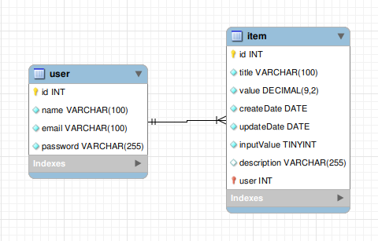

> 


# Kinvo - Desafio Back-end

## Descrição

O desafio era criar uma API para gerenciar finanças de um estudante. Este projeto for criado utilizando: setup inicial do [nestjs](https://docs.nestjs.com/#alternatives "doc nestjs"), [typeorm](https://typeorm.io/ "doc typeorm"), [typeScript](https://www.typescriptlang.org/ "doc typescript"), [docker-compose](https://docs.docker.com/compose/overview/ "doc docker-compose"), [node](https://nodejs.org/en/ "doc node"), [mysql](https://www.mysql.com/ "doc mysql"), [jest](https://jestjs.io/ "doc jest"), [bcrypt](https://www.npmjs.com/package/bcrypt "doc bcrypt"), [postman](https://www.postman.com/ "doc postman"), [eslint](https://eslint.org/ "doc eslint"), [prettier](https://prettier.io/ "doc prettier"). Validação de entrada de dados feita com [class-validator](https://www.npmjs.com/package/class-validator "docs class-validator").

## Rodando localmente

### Baixando o projeto

```bash
# clonando o projeto
$ git clone git@github.com:Dogl4/challenge-manage-finances.git
```

```bash
# instalando dependências
$ npm install
```

### Iniciando o server

#### Docker | Mysql | DataBase

```bash
# subindo o container do banco de dados, mysql
$ docker-compose up -d

# verifique se o container docker foi criado
$ docker ps

# se quiser parar o container
$ docker-compose down

# se quiser limpar os container parado e deletar as imagens docker no seu pc
$ docker system prune -a
```

#### API | Server

```bash
# development | iniciando a api, depois que o container do docker estiver ativo
$ npm run start

# watch mode | esta que utilizei durante o desenvolvimento
$ npm run start:dev

# production mode
$ npm run start:prod
```

## Test

```bash
# unit tests
$ npm run test

# test coverage
$ npm run test:cov
```

## Enpoints

### Usuário

- <details>
      <summary>POST (cadastra)</summary>

  - Url:
     - `/user`
     - Exemplo: `http://localhost:3000/user`

  - Request:
    - Body

        ```json
        {
            "name": "Dogl4",
            "email": "doougllas@kinvo.com",
            "password": "123456"
        }
        ```

  - Response: 
    - Status: `201 Created`
    - Body

      ```json
      {
          "message": "User created successfully"
      }
      ```

</details>

- <details>
      <summary>GET (busca todos)</summary>

  - Url:
     - `/user`
     - Exemplo: `http://localhost:3000/user`

  - Response: 
    - Status: `200 OK`
    - Body

      ```json
      [
          {
              "id": 1,
              "name": "Dogl4",
              "email": "dogla@email.com",
              "password": "$2b$08$xO6ttGh0dmnBjDtIwR7gguETGOEACwquyE.RhzvP.E32zzy5FxEEO"
          }
      ]
      ```

</details>

- <details>
      <summary>DELETE (deleta por id)</summary>

  - Url:
    - `/user/:id`
    - Exemplo: `http://localhost:3000/user/1`

  - Response: 
    - Status: `204 No Content`

</details>

### Finanças

- <details>
      <summary>POST (cadastra transação)</summary>

  - Nota: somente cria se o campo `user` estiver um id de usuário valido no banco de dados, então tem que cadastrar um usuário primeiro e obter o id dele para criar o item(transação). O campo `inputValue` é um booleano, se for true, é uma transação de entrada, se for false é uma transação de saída.

  - Url:
     - `/item`
     - Exemplo: `http://localhost:3000/item`

  - Request:
    - Body

        ```json
        {
            "title": "Salário",
            "value": 3000.1,
            "inputValue": true,
            "user": 1
        }
        ```

  - Response: 
    - Status: `201 Created`
    - Body

      ```json
      {
          "createdDate": "2022-07-10T05:03:45.344Z",
          "title": "Salário",
          "value": "3000.1",
          "inputValue": true,
          "user": 1,
          "updatedDate": null,
          "id": 8,
          "description": ""
      }
      ```

</details>

- <details>
      <summary>GET (busca todos, com paginação)</summary>

  - Nota: page e limit é opcional, onde page é a página e limit é o limite de itens por página. O padrão é page 1 e limit 10, se não informar page ou limit)

  - Url:
     - `/item` ou `/item?&page=page&limit=limit`
     - Exemplo: `http://localhost:3000/item`
     - Exemplo: `http://localhost:3000/item?&page=1&limit=200`

  - Response: 
    - Status: `200 OK`
    - Body

      ```json
      {
          "infoPage": {
              "totalPage": 1,
              "currentPage": 1,
              "totalItems": 1,
              "itemsPerPage": 10
          },
          "data": [
              {
                  "id": 8,
                  "title": "Salário",
                  "value": "3000.1",
                  "createdDate": "2022-07-10 05:03:45.344",
                  "updatedDate": null,
                  "inputValue": true,
                  "description": ""
              }
          ]
      }
      ```

</details>

- <details>
      <summary>GET (busca por id)</summary>

  - Url:
    - `/item/:id`
    - Exemplo: `http://localhost:3000/item/1`

  - Response: 
    - Status: `200 OK`
    - Body

      ```json
      {
          "infoPage": {
              "totalPage": 1,
              "currentPage": 1,
              "totalItems": 1,
              "itemsPerPage": 10
          },
          "data": [
              {
                  "id": 1,
                  "title": "Salário",
                  "value": "3000.1",
                  "createdDate": "2022-07-10 05:03:45.344",
                  "updatedDate": null,
                  "inputValue": true,
                  "description": ""
              }
          ]
      }
      ```

</details>

- <details>
      <summary>PUT (atualiza por id)</summary>

  - Url:
    - `/item/:id`
    - Exemplo: `http://localhost:3000/item/1`

  - Request:
    - Params, exemplo: `/item/1`
    - Body

        ```json
        {
            "title": "Comida",
            "value": 20.05,
            "inputValue": false,
            "user": 1
        }
        ```

  - Response: 
    - Status: `202 Accepted`
    - Body

      ```json
        {
            "id": 1,
            "title": "Comida",
            "value": "20.05",
            "createdDate": "2022-07-10 05:28:11.485",
            "updatedDate": "2022-07-10 05:29:19.876",
            "inputValue": false,
            "description": ""
        }
      ```

</details>

- <details>
      <summary>DELETE (deleta por id)</summary>

  - Url:
    - `/item/:id`
    - Exemplo: `http://localhost:3000/item/1`

  - Request:
    - Params, exemplo: `/item/1`

  - Response: 
    - Status: `204 No Content`

</details>

- <details>
      <summary>GET (obtém saldo)</summary>

  - Url:
    - `/item/balance`
    - Exemplo: `http://localhost:3000/item/balance`

  - Response: 
    - Status: `200 OK`
    - Body

      ```json
      {
          "balance": 0
      }
      ```

      ```json
      {
          "balance": 3000.1
      }
      ```

</details>

- <details>
      <summary>GET (filtra transações por data, com paginação)</summary>

  - Nota: page e limit é opcional, onde page é a página e limit é o limite de itens por página. O padrão é page 1 e limit 10, se não informar page ou limit.

  - Url:
    - `/item/filterByDate/:dateInit/to/:dateEnd` ou `/item/filterByDate/:dateInit/to/:dateEnd?&page=page&limit=limit`
    - Exemplo: `http://localhost:3000/item/filterByDate/2020-07-10/to/2020-07-10`
    - Exemplo: `http://localhost:3000/item/filterByDate/2020-07-10/to/2020-07-10?&page=1&limit=200`

  - Response:
    - Status: `202 Accepted`
    - Body

      ```json
      {
          "infoPage": {
              "totalPage": 1,
              "currentPage": 1,
              "totalItems": 5,
              "itemsPerPage": 200
          },
          "data": [
              {
                  "id": 6,
                  "title": "Salário",
                  "value": "3000.1",
                  "createdDate": "2022-07-10 05:42:56.588",
                  "updatedDate": null,
                  "inputValue": true,
                  "description": ""
              },
              {
                  "id": 7,
                  "title": "Salário",
                  "value": "3000.1",
                  "createdDate": "2022-07-10 05:42:57.163",
                  "updatedDate": null,
                  "inputValue": true,
                  "description": ""
              },
              {
                  "id": 8,
                  "title": "Salário",
                  "value": "3000.1",
                  "createdDate": "2022-07-10 05:42:57.673",
                  "updatedDate": null,
                  "inputValue": true,
                  "description": ""
              },
              {
                  "id": 9,
                  "title": "Salário",
                  "value": "3000.1",
                  "createdDate": "2022-07-10 05:42:59.691",
                  "updatedDate": null,
                  "inputValue": true,
                  "description": ""
              },
              {
                  "id": 10,
                  "title": "Salário",
                  "value": "3000.1",
                  "createdDate": "2022-07-10 05:43:00.472",
                  "updatedDate": null,
                  "inputValue": true,
                  "description": ""
              }
          ]
      }
      ```

</details>

## Banco de Dados

|  |
|-----------------------------------------|
| _Modelo_,  _Tabelas_,  _Campos_         |
## License

  Nest is [MIT licensed](https://github.com/nestjs/nest/blob/master/LICENSE).
